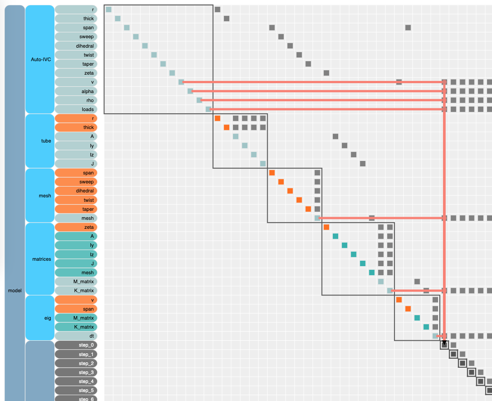
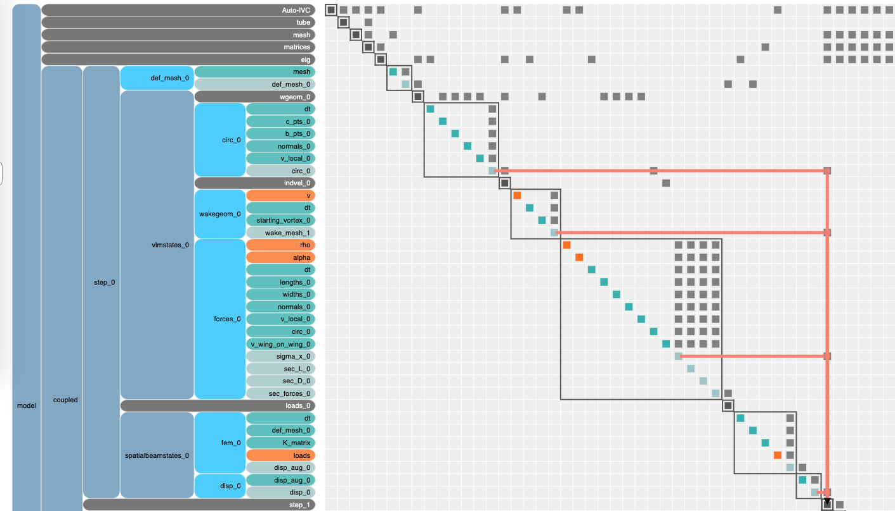
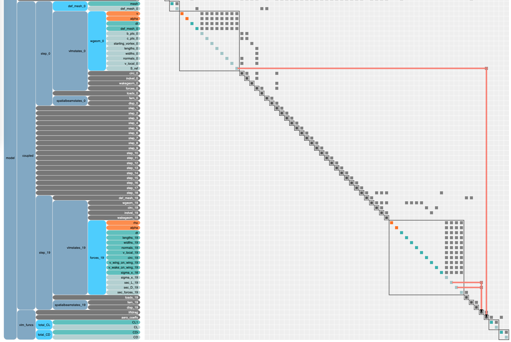
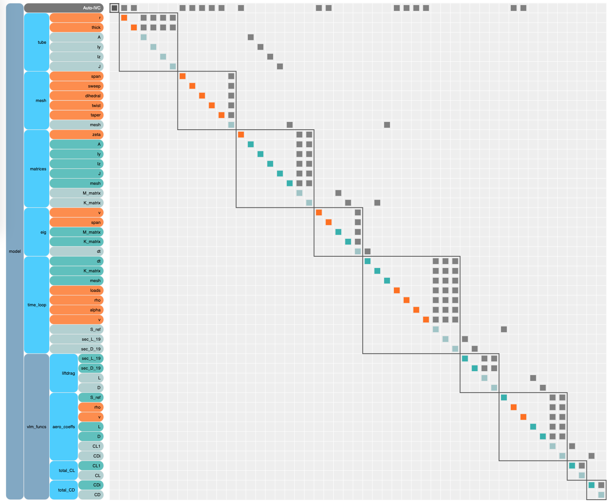

# Original Request From @shamsheersc19

## Background:
* [OpenAeroStruct (OAS)][0] is gaining popularity and is often advertised as a good example of a practical application that takes advantage of the strengths of OpenMDAO.
* A few years ago, Giovanni Pesare implemented an unsteady VLM solver with OAS with a little direction from @shamsheersc19 (see attached thesis).
* In order to take advantage of OpenMDAO's analytic derivatives, the only clear path was to stamp out copies 
of the time-varying states for each time instance inside an OpenMDAO model. 
* This seems like a less than ideal way to set it up, are there better ways? 

# Structure of an unsteady problem

As Giovanni Pesare points out in his thesis, an unstead problem is made up of three parts: 

1) A block of computations before the unsteady part
2) The unsteady part
3) A block of computations after the unsteady part


In this code, we can see that the before block includes the groups named `tube`, `mesh`, `matricies`, and `eig`. 
The entire unsteady block is contained inside the `coupled` group (thats a weird name for that group since nothing is coupled, but we wanted to change the code as little as possible so we left it.)
The after block is contained in the `vlm_funcs` group. 

The waterfall nature of this time loop clearly shows up in the N2 diagram above where each time step feeds directly into the next. 
This style of unsteady model is not the most efficient way to set it up. 
You have to keep all times in memory at once, but you're also constrained to evaluating all times in sequence. 

A better approach would be to wrap the time-loop into a component that does the time-stepping for you with a sub-problem to hold the guts of the time-varying calculation. 

## Converting the analysis into a time-loop

In order to break the model down we needed to map the I/O from the *before block* into the time loop, 
the i/o between each time step, and the i/o to the *after block* from the time loop. 

### I/O: Before block -> time loop  
Using the N2, we can see what the various inputs variables are: `dt`, `K_matrix`, `mesh`, `loads`, `rho`, `alpha`, `v`



### I/O: time_i -> time_i+1

Again, using the N2 diagram we can find the necessary data passing: `circ_{i}`, `circ_wake_{i}`, `wake_mesh_{i}`, `sigma_x_{i}`, `disp_{i}`


### I/O: time loop -> after block

Lastly we have the inputs from the time-loop to the final calculation block: 
`S_ref` (which is a bit weird, because it comes from time step 0)
`sec_L_19`, an `sec_D_19`. 




### The model is much simpler with a for loop

At the run-script level, the changes are extremely minor. 
Commented out parts are from the non-for loop part.  

```python 

# Time loop
# coupled = om.Group()
# for t in range(num_dt):
#     name_step = 'step_%d'%t
#     coupled.add_subsystem(name_step,
#                 SingleStep(num_x, num_y_sym, num_w, E, G, mrho, fem_origin, SBEIG, t),
#                 promotes=['*'])

# root.add_subsystem('coupled',
#          coupled,
#          promotes=['*'])

root.add_subsystem('time_loop', TimeLoopComp(num_x, num_y_sym, num_w, E, G, mrho, fem_origin, SBEIG, num_dt), 
                   promotes=['*'])
```
The change in the N2 is much more visible. 

